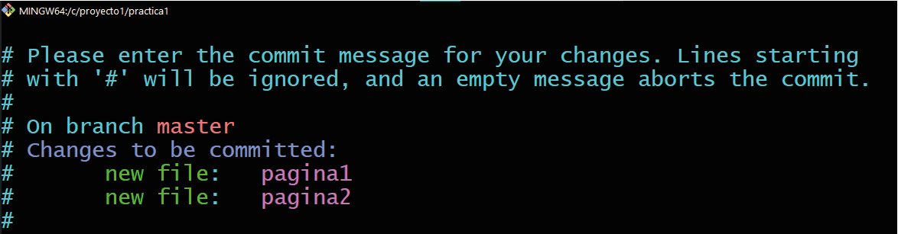

# Comenzamos con Git.
1. [Configurando Git por primera vez](#Configurando-Git-por-primera-vez)
2. [Crear un repositorio en Git](#Crear-repositorio-en-Git)
3. [Historial de confirmaciones](#Historial-de-confiramciones)
4. [Volver a una versión anterior](#Volver-a-una-versión-anterior)
---

## Configurando Git por primera vez
- Configuarando Git.

  Lo primero que deberás hacer cuando instales Git es establecer tu nombre de usuario y dirección de correo electrónico. Esto es importante porque los "commits" de Git usan esta información, y es introducida de manera inmutable en los commits que envías.
  ~~~
  C:\proyecto1(master)
  λ git config --global user.name "Alexander"

  C:\proyecto1(master)
  λ git config --global user.email "capuli.2015@gmail.com" 
  ~~~

- Comprovando la configuración.

  Muestra todas las propiedades que Git ha configurado.
  ~~~
  user.name=Alexander
  user.email=capuli.2015@gmail.com
  core.repositoryformatversion=0
  core.filemode=false
  ~~~

- Como obterner ayuda.

  Existen tres formas de ver la página del manual.
  ~~~
  $ git help <verb>
  $ git <verb> --help
  $ man git-<verb>
  ~~~
- Resumen.

  En este momento debes tener una comprensión básica de lo que es Git, y en qué se diferencia de cualquier otro sistema de control de versiones centralizado que pudieras haber utilizado previamente. De igual manera, Git debe estar funcionando en tu sistema y configurado con tu identidad personal. Es hora de aprender los fundamentos de Git.
---

## Crear repositorio de Git
Para inicializar un repositorio con Git se usa el comando git init.
~~~
C:\proyecto1
λ git init
Initialized empty Git repository in C:/proyecto1/.git/
~~~

Para obtener la información necesaria sobre la rama actual usa el comando git status.
~~~
C:\proyecto1(master)
λ git status
~~~

Para incluir los cambios del o de los archivos en tu siguiente commit usa el comando git add.
~~~
C:\proyecto1(master)
λ git add Biografia.txt
~~~

Para eliminar archivos usa el comando rm.
~~~
C:\proyecto1(master)
λ rm Biografia.txt
~~~

Para guardar los cambios usa el comando git commit.
~~~
C:\proyecto1(master)
λ git commit -m "Este es el primer commit de este archivo"
~~~
Recuerda siempre usar git add para cualquier cambio.

Importante.

Para no nos mande al editor VIM.
Recuerda siempre agregar un mensajes.
~~~
C:\proyecto1(master)
λ git commit
~~~

Para salir del editor VIM  
- Esc + shift + z
- Esc :q para salir 
- Esc :wq para salir guardando
--- 
## Historial de confirmaciones 
Para mostrar todos los commits en el historial del repositorio usa el comando git log.
~~~
C:\proyecto1(master)
λ git log Biografia.txt
~~~
Para mostrar todos los cambios específicos en el historial del repositorio, usa el comando git log --stat
~~~
C:\proyecto1(master)
λ git log --stat
~~~
Para ver detalles ampliados en objetos de Git, como blobs, árboles, etiquetas y confirmaciones usa el comando git show.
~~~
C:\proyecto1(master)             
λ git show Biografia.txt 
~~~
Para ver las diferencias con los archivos anteriores
usa el comando git diff.
~~~
C:\proyecto1(master)
λ git diff 0698cddd344bd99c374a72b0ba89da3bd9af6d31
 02733e70ade0519ea2fe0868d1d09c652780a2b4
~~~
## Volver a una versión anterior 
Para regresar a una versión anterior usa el comando git checkout.
~~~
C:\proyecto1(master)
λ git checkout 6b9da92efb48624065d33b9b9aeba16e2fa3c5fa 
~~~
Para borrar y regresar a una versión  anterior usa el comando git reset.
~~~
C:\proyecto1(master)
λ git reset 6b9da92efb48624065d33b9b9aeba16e2fa3c5fa --hard
~~~
