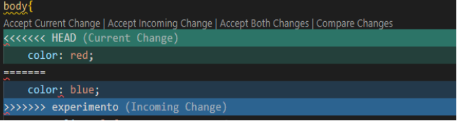

# Ramificaión en Git.
1. [Introducción a ramificación](#Introducción-a-ramificación)
2. [Crear ramas](#Crear-ramas)
3. [Fusión de ramas](#Fusión-de-ramas)
4. [Conflictos al fusionar ramas](#Conflictos-al-fusionar-ramas)
---

## Introducción a ramificación. 
Una rama es una desviación en la línea de tiempo del proyecto que nos permite crear una copia paralela para desarrollar cambios sin afectar la versión estable.

---

## Crear ramas.
Para crear una rama usa el comando git branch
~~~
C:\proyecto1(master)
λ git branch experimento
~~~
Para ver cuantas ramas tienes usa el comando git branch --list.
~~~
C:\proyecto1(master)
λ git branch
  experimento
* master
~~~
Para entrar a las ramas, usa el comando git checkout.
~~~
C:\proyecto1(master)
λ git checkout experimeto
Switched to branch 'experimeto'
~~~
Para eliminar la rama, esta es una operación segura, ya que Git evita que elimines la rama si tiene cambios que aún no se han fusionado.  usa el comando git branch -d.
~~~
C:\proyecto1(master)
λ git branch -d experimento1
~~~
Para eliminar la rama de forma permanente todas las confirmaciones asociadas con una línea concreta de desarrollo, usa el comando git branch -D. 
~~~
C:\proyecto1(master)
λ git branch -D experimento
~~~

## Fusión de ramas.
Para ya no usar git add en los cambios antes de hacer el commit use el comando git commit -am. 
~~~
C:\proyecto1(master)
λ git commit -am "se agregó todo el archivo"
[master fe2257d] se agregó todo el archivo
~~~
Para crear un nuevo commit con la combinación de dos ramas usa el comando git merge.
~~~
C:\proyecto1(master)
λ git merge experimento
~~~
## Conflictos al fusionar ramas.
Cuando en las ramas se hacen los mismos cambios al ejecutar el comando git merge. nos mostrará error.
~~~
C:\proyecto1(master)
λ git merge experimento
Auto-merging css/estilos.css
CONFLICT (content): Merge conflict in css/estilos.css
Automatic merge failed; fix conflicts and then commit the result.
~~~

